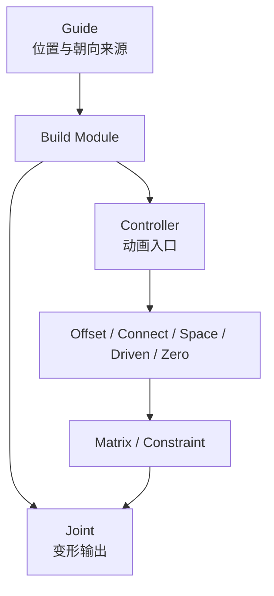

# Guide、Controller 与 Joint 的节点关系

MuziTools 将位置来源、动画入口和变形输出分开管理，使模块可以安全重建。

| 层 | 保存什么 | 不应该保存什么 |
| --- | --- | --- |
| Guide | 构建位置、朝向、左右语义 | 动画和最终连接 |
| Controller | 动画属性与选择形状 | 唯一构建位置 |
| Hierarchy | Offset、空间切换和驱动隔离 | Guide 配置 |
| Connection | Matrix、Constraint 和属性连接 | 可编辑 Guide 状态 |
| Joint | Skin / Deformer 的稳定输出 | UI 状态 |

## 控制器为什么会偏离 Guide

常见原因是同一份 Transform 被应用两次：先将 Controller 对齐 Guide，随后又给 Offset 组设置同一 World Matrix，形成双重偏移。

检查顺序：

1. Guide World Matrix。
2. Offset Group World Matrix。
3. Controller Local Transform。
4. Parent 或 Matrix 连接是否再次叠加位移。
5. 重建时是否复用旧约束。

## Connect 为什么独立

Step 03 允许调整 Controller 外观和 Joint 显示。独立的 Step 04 让连接成为可重复执行、可清理和可验证的阶段，避免回退重建后留下旧连接。

