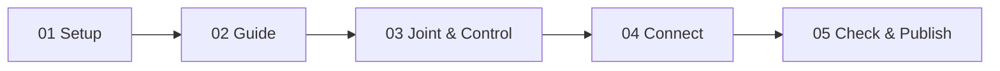

# MuziTools

MAYA 2023 · RIGGING FRAMEWORK

把 Guide、Joint、Controller 和连接阶段组织成一套可重复构建的绑定流程。

[开始第一次绑定](tutorials/first-face-rig.md){ .md-button .md-button--primary }
[查找一个方法](reference/index.md){ .md-button }

-   :material-school-outline:{ .lg .middle } **从零完成一次绑定**

    跟随 Maya 实际操作，从检查场景到构建、连接和发布。

    [进入教程](tutorials/first-face-rig.md)

-   :material-tools:{ .lg .middle } **解决一个具体问题**

    镜像 Guide、重建模块、调整控制器或检查失败结果。

    [操作指南](how-to/index.md)

-   :material-graph-outline:{ .lg .middle } **理解系统为什么这样工作**

    阅读生命周期、数据来源、层级与 Maya 节点关系。

    [原理说明](explanation/index.md)

-   :material-code-braces:{ .lg .middle } **查参数与源码入口**

    自动从当前 Runtime 源码生成，不包含 `legacy_reference`。

    [API 索引](reference/index.md)

## 推荐工作流

| 阶段 | 在 Maya 中完成什么 | 可以回退修改 |
| --- | --- | --- |
| 01 Setup | 检查模型、创建根层级、确定模块 | 是 |
| 02 Guide | 定位、镜像并保存 Guide | 是 |
| 03 Joint & Control | 生成并调整 Joint / Controller | 是 |
| 04 Connect | 建立矩阵、约束与模块输出连接 | 修改后应重新生成连接 |
| 05 Check & Publish | 运行检查、清理并保存交付版本 | 回退前先保存场景版本 |

!!! info "当前实现"
    当前正式 Face Runtime 已接入双眼、左右耳朵和舌头。尚未接入的模块不会写成已经可用。

## 按角色进入

| 你现在要做什么 | 从这里开始 |
| --- | --- |
| 第一次使用工具 | [安装与启动](getting-started/installation.md) |
| 在 Maya 中完成 Face Rig | [完整教程](tutorials/first-face-rig.md) |
| 修改 Guide 后重新生成 | [安全重建模块](how-to/rebuild-module.md) |
| 看懂 Joint、Controller 和连接 | [节点关系](explanation/node-relationships.md) |
| 查类、方法和参数 | [API Reference](reference/index.md) |
| 修改或扩展源码 | [开发指南](development/documentation.md) |

## 文档原则

- 教程带你完成一次完整结果。
- 操作指南解决一个明确问题。
- 原理说明解释设计与节点关系。
- API 参考只描述当前正式源码。
- 截图只用于需要视觉确认的步骤，并标注 Maya 版本与拍摄状态。

