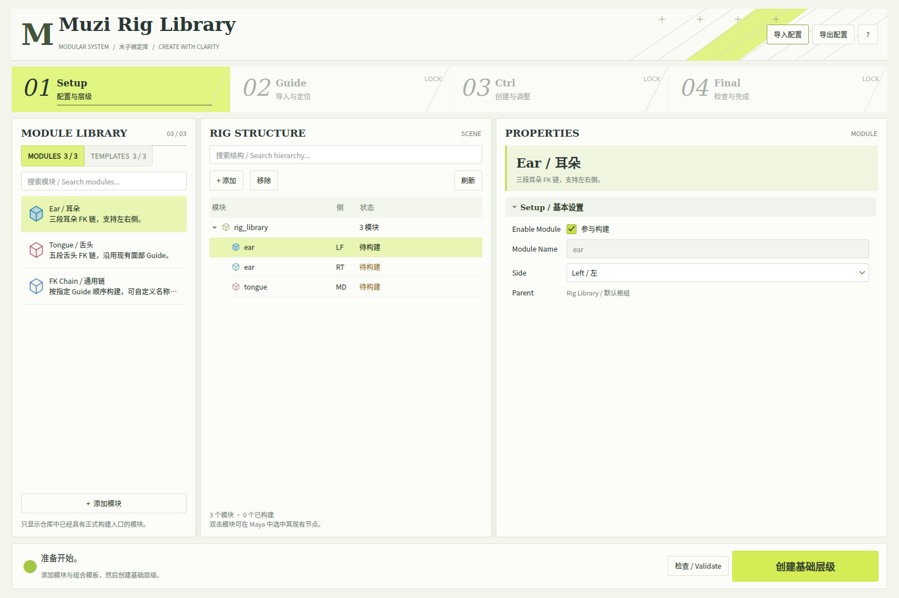

# 模块化绑定库

绑定库按当前仓库重写后的实现接入 **EarModule、TongueModule、FKChain**。旧 Face System 已归档，新窗口不会导入 legacy_reference。Eye 目前仍是未完成文件，因此没有放进可构建目录。

## 打开窗口

更新代码后重启 Maya，在 Python Script Editor 中运行：

```python
import muziToolset
window = muziToolset.show_rig_library()
```

工具箱的“模块化绑定库”和“面部绑定库”也会打开同一个窗口。窗口保留强引用，支持最小化、恢复和关闭后重新打开。



此图由真实 Qt 控件渲染，使用 Face Starter 演示配置；不是 Maya 运行验证截图。

## 参考图如何落地

| 参考图区域 | 当前实现 |
| --- | --- |
| 明亮暖白底、酸橙色强调、工业线条 | 局部 QSS、矢量页眉装饰和数字切角导航；不依赖位图背景 |
| 顶部四步导航 | Setup / Guide / Ctrl / Final |
| Modules 左栏 | 当前可用模块、搜索、添加 |
| Templates 左栏 | 已实现模块的组合模板，重复添加保留已有设置 |
| Rig Structure 中栏 | 只显示模块配置、Side 与构建状态；双击模块可选择其现有场景节点 |
| Properties 右栏 | 跟随当前步骤，只显示 Setup、Guide、Controller 或 Joint 对应设置 |
| Validate / Ctrl / Final 底栏 | 只读预检查、当前阶段动作、失败详情 |
| 小窗口 | 三栏可拖动调宽，左侧目录与右侧属性独立滚动 |

工作流收敛为四步：**Step 03 Ctrl** 一次构建骨骼和控制器，并在右侧实时调整外观；**Step 04 Final** 检查已构建模块并选择全部主控制器。底层继续沿用现有 FKChain.build 完整生命周期。

## 已接入内容

| 模块 | 默认 Guide | 构建方式 |
| --- | --- | --- |
| Ear / 耳朵 | 左侧或右侧 3 个 bind Locator | EarModule → FKChain |
| Tongue / 舌头 | 中央 5 个 bind Locator | TongueModule → FKChain |
| FK Chain / 通用链 | 用户按行指定的 1–99 个 Transform 或 Joint | FKChain |

| 模板 | 内容 |
| --- | --- |
| Face Starter / 面部起步 | 左耳、右耳、舌头，共 3 个模块、11 个关节 |
| Ear Pair / 左右耳 | 左右耳，共 2 个模块、6 个关节 |
| Tongue / 舌头 | 中央舌头，共 1 个模块、5 个关节 |

Face Guide 使用仓库的 resources/module_guide/face_guide.ma。模板中其他部位的 Locator 仍然存在，但本轮只构建上表模块。

## 使用流程

1. 在左侧添加模块，或添加 Face Starter 模板。
2. Setup → 创建基础层级。
3. Guide → 导入 Face Guide，在 Maya 中调整定位。
4. 通用 FK 在右侧 Guide 抽屉内填写每行一个节点，或读取当前选择，然后核对顺序并保存。耳朵、舌头留空时按标准名称查找 Guide。
5. Validate 检查 Guide、节点类型、同名输出和根组归属。
6. Ctrl 创建所有启用的待建模块，已经构建的模块自动跳过，并可调整大小、索引颜色、形状朝向、关节半径与显示。
7. Final 检查全部模块并选择所有已构建主控制器。

`RIG STRUCTURE` 模块行的右键菜单提供左右镜像。选择尚未构建的 LF 或 RT 模块并右键，可将控制器大小、轴向、关节半径和显示设置复制到配对侧，并把对应 Guide 的世界位置沿 `X=0` 镜像。模块名称、Side、内部 ID、Guide 路径和左右颜色不会被覆盖；左右 Guide 必须已经导入且数量一致。

已构建模块锁定名称、Side、Guide 和参与构建开关。外观调整通过已有 Ctrl / Jnt 接口进行；大小使用“新值 / 旧值”比例修改 CV，不重建控制器，不修改 Transform。

## 配置与场景

配置保存在 network_md_rig_library_config_001 的字符串属性 muziRigLibraryJson 中，随 Maya 场景保存。打开窗口不创建场景内容。撤销、重做及切换场景后，窗口重新读取配置。

JSON 导入和导出仅处理模块参数，不包含 Maya 绑定节点或 Guide 的位置。导出会清除 built 状态；导入采用追加方式，同名模块冲突时整次导入失败。

本轮支持根命名空间中的一套绑定库。新增 UI 和服务使用 maya.cmds；现有 Guide、FKChain 所依赖的 Core 仍需要仓库原有的 PyMEL 环境。未在此改动中重写这些底层依赖。

构建操作与配置写入属于同一个 Maya Undo Chunk；操作失败时回滚本次改动。预检查不会认领已有同名输出，也不会覆盖不属于绑定库的根组。场景中删除或替换已构建节点后，应先修复场景，再更新外观。

## 开发与验证

- library_catalog.py：可用模块、组合模板、配置校验、标准节点名称。
- library_service.py：场景持久化、构建调度、预检查和外观更新。
- ui/modular_rig_ui.py：布局和交互。
- ui/library_widgets.py、ui/library_style.py：局部视觉组件。
- core/common/transform_utils.py：Locator 对齐采用 Shape.worldPosition，修正非零 localPosition 引起的偏移。

普通 Python 验证：

```bash
python tests/rig_library_test.py
python -m pip install "PySide6-Essentials>=6.5,<7"
QT_QPA_PLATFORM=offscreen python tests/rig_library_qt_test.py
```

本次验证：16 项服务与配置测试、6 项真实 Qt 交互测试通过；修改文件语法编译和 git diff --check 通过。实际窗口在 1440×980 与 1120×740 下检查布局。

仓库原有 Static Contract Tests 的 17 项检查，在基线 ff4a747 与本次改动上都为 3 项通过、14 项失败。失败来自旧路径、缺失的旧系统文件及现存非 UTF-8 文件；本次未扩大修复范围。新增 Rig Library Tests 工作流独立验证本轮功能。

Maya 2023 真实运行尚未在开发容器中执行。请在新的空场景里运行：

```python
from muziToolset.tests import rig_library_maya2023_smoke_test
result = rig_library_maya2023_smoke_test.run()
print(result)
```

这个测试不会强制清空已有场景。它会创建 3 个模块，检查 11 个 Guide 对齐位置、11 个关节和主控制器、重复构建、外观往返调整，以及世界矩阵和连接保持不变。执行后保留结果供目视检查。
