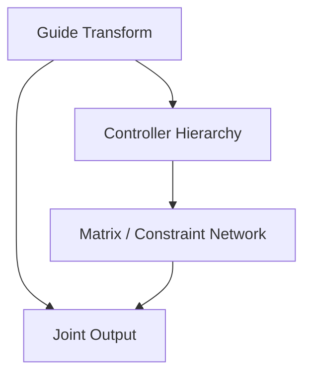

# 完成第一次 Face Rig

这是一条从空场景检查到可交付结果的完整路线。第一次操作时请按顺序执行。

## 开始前

- Maya 2023 已能正常启动 MuziTools。
- 模型 Transform、命名和 History 已检查。
- 当前场景已另存为新的工作版本。
- Outliner 中不存在旧的 Face Rig 构建结果。

## 01 · Setup

打开 Rig Library，创建或载入角色配置。确认 Face Joint 与 Controller 根组可用，并添加需要构建的模块。

**完成标志：** 模块清单、左右侧设置和根层级均正确。

## 02 · Guide

导入 `face_guide.ma`，在正交与透视视图中定位 Locator。Eye 使用 Ball、Iris、Aim 三种明确语义；Ear 与 Tongue 使用标准 Bind Locator。

1. 先调整中线模块。
2. 完成一侧定位。
3. 使用镜像生成另一侧。
4. 检查镜像轴和命名。

**完成标志：** 每个 Guide 都贴合模型，左右语义正确，场景中只有一套 Guide Root。

## 03 · Joint & Control

从 Guide 生成 Joint、Controller 和模块层级。

| 对象 | 可调整内容 |
| --- | --- |
| Controller | Shape、Size、Color、Axis、Visibility |
| Joint | Radius、Local Axis、Visibility |

若 Guide 位置不正确，回到 Step 02 修改后执行 Rebuild。

**完成标志：** Joint 与 Controller 对齐 Guide，命名一致，大小适合动画选择。

## 04 · Connect

加载已生成的模块输出，再建立正式连接。连接阶段消费 Step 03 的结果，不重新猜测位置。

如果回退修改 Guide 或重建输出，应重新执行本阶段。

**完成标志：** 移动控制器时只有预期 Joint 响应，双眼 Aim 行为正确。

## 05 · Check & Publish

按 [检查与发布清单](../how-to/check-and-publish.md) 验证命名、层级、镜像、锁定属性、重复构建以及保存重开。完成后保存新的发布版本，不覆盖最后一个工作文件。

## 下一步

- [安全重建模块](../how-to/rebuild-module.md)
- [理解节点关系](../explanation/node-relationships.md)
- [FaceModule API](../reference/systems/face/face_module.md)

